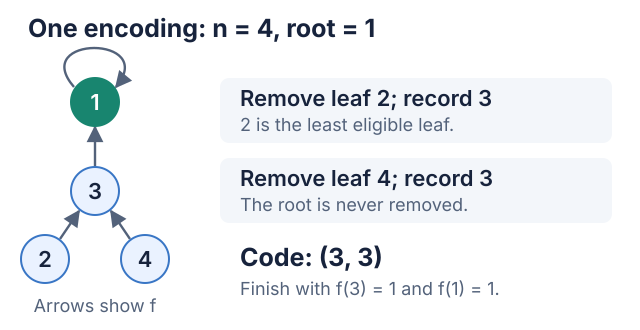

# Worked example: Cayley's formula

We used **GPT-5.5 xhigh with Codex subagents** to work through a classical form
of Cayley's formula. The run produced a proof in one round, without additional
hints, and passed its proof reviews.

Below, you can follow the [input](input/target.md), each stage's output, and the
[final proof](proof/final_proof.md). A parent Codex agent ran the workflow
directly, without the Python API runner.

## The problem

Choose a function from $[n]=\{1,\ldots,n\}$ to itself uniformly at random.
Draw an arrow from each vertex $i$ to $f(i)$. What is the probability that
exactly one vertex lies on a directed cycle? The theorem says **$1/n$**.

For example, when $n=3$, there are 27 functions and 9 qualify. The general
statement is equivalent to Cayley's formula for counting labelled trees.
We used the unnumbered theorem in Chapuy and Perarnau's
[short arXiv paper](https://arxiv.org/abs/2306.12918v1).

The solver could use definitions and basic finite probability, but had to
prove the counting argument itself. Other statements from the paper were
visible in the input packet but marked as unavailable for use in the proof.

The proof turns each function with a fixed cyclic root into a short sequence
of labels, then shows how to recover the function from that sequence. Here is
one example:



## Follow the run

S0 divided the problem into five parts. S3 tackled the main counting argument
first; once it finished, the other solvers completed their parts. S6 combined
them into a proof, which then went through the statement, source, and
mathematical reviews.

| Stage | Input | Saved output |
|---|---|---|
| Manual preparation | [Source paper](https://arxiv.org/abs/2306.12918v1); proof kept private | [Skeleton](input/skeleton.md) and [allowed support](input/allowed_support.md) |
| Check the input | Original source and prepared input files | [Input audit](stages/setup_audit.md) |
| S0 — plan | [Prompt and input](packets/S0.md) | [Plan and assignments](stages/S0.md) |
| S3 — main counting argument | [Prompt and input](packets/S3.md) | [Encoding and decoding proof](stages/S3.md) |
| S1, S2, S4, S5 — remaining parts | Each solver's [prompt and assignment](packets/) | [Sample space](stages/S1.md), [orbit structure](stages/S2.md), [root counts](stages/S4.md), [final ratio](stages/S5.md) |
| S6 — compose | [S0 and all five subproofs](packets/S6.md) | [Proof](proof/final_proof.md) · [full S6 response](stages/S6.md) |
| Check the statement and sources | Proof and solver inputs | [Statement check](stages/problem_statement.md), [source list](stages/citation_generator.md), [citation review](stages/citation_verifier.md) |
| A1 / A2 / A3 | The [same review packet](packets/verifier_a.md), in fresh agents | [A1](stages/A1.md), [A2](stages/A2.md), [A3](stages/A3.md) |
| Composer A — combine the reviews | [Three A reports only](packets/composer_a.md) | [Combined findings](stages/composer_a.md) |
| B, then C | Proof and public inputs; no earlier mathematical referee verdicts | [Weak-point review](stages/verifier_b.md), [adversarial review](stages/verifier_c.md) |
| Private Final Checker | Candidate and reference proof; no A/B/C verdicts | [Public verdict](stages/final_checker_public.json) |
| Record and check the decision | [Decision prompt](packets/decision.md) and [audit prompt](packets/controller_audit.md) | [Final decision](stages/decision.md), [workflow audit](stages/controller_audit.md) |

Open any [role packet](packets/) to see the exact prompt and input. The
[run record](dispatches.json) lists the model settings and order of the roles.

## Outcome

The run finished in **one round, with no added hints or separate lemma runs**.
All three A reviewers found no gaps, B found no weak point, and C's attack did
not break the argument. The private Final Checker returned `PASS`, and a
separate audit confirmed that the workflow followed its decision rules.

Read the [two-page proof PDF](proof/final_proof.pdf) or inspect the
[one-page input skeleton PDF](input/skeleton.pdf). These are recorded
reviews by the same language model in separate sessions, not formal
verification. This is a worked example of a known theorem, not a benchmark
result or a claim of new mathematics.

Want a quick hands-on check? From the repository root, run:

```bash
python3 Examples/cayley/check_small_cases.py
```

This enumerates every function for $n=1,\ldots,6$ and reproduces the saved
[small-case counts](finite_check.json). It needs no API key or extra packages.
This checks small cases only, not the general theorem. It was run separately
and was not supplied to the solvers.

<details>
<summary>Run settings and reproducibility</summary>

The input was prepared using the protocol's manual-cleaning option. Neither
Python cleaner nor the Python controller was run or changed.

Every role used GPT-5.5 xhigh in a fresh session. Solvers and proof reviewers
did not browse, though the model may already know this classical result.
Agents were instructed which files they could read; they did not have separate
filesystem sandboxes. Codex did not expose a temperature setting, so we could
not enforce the protocol's temperature-0 setting for the Final Checker.

The [manifest](manifest.json) lists the checks, settings, and file hashes.
The original source, reference proof, and private checker prompt and reasoning
are not included here. Use the paper's source link to prepare a new run, and
keep its proof separate from the solver's inputs.

</details>

[Project README](../../README.md) · [Protocol](../../Prompt%20Packet/FlowChart.md)
