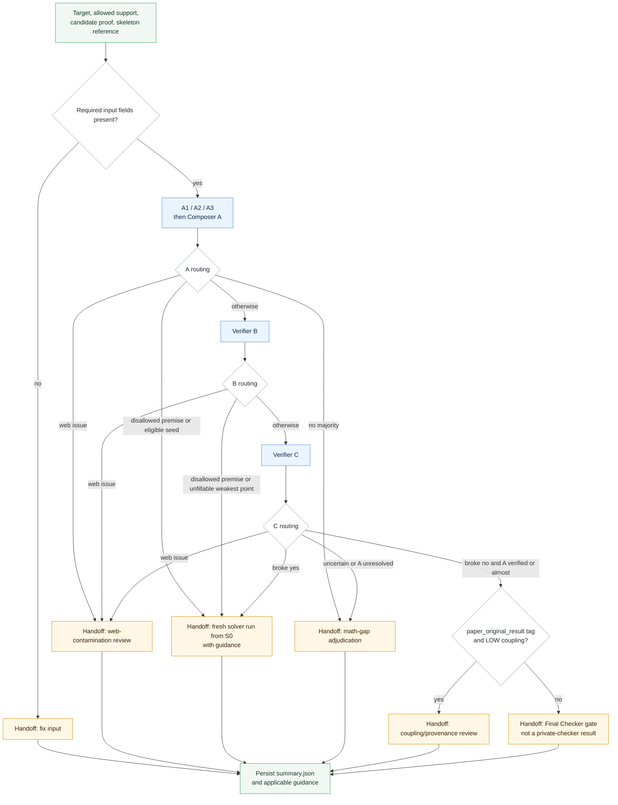

# Verifier cascade and handoffs

The standalone verifier package checks one candidate and records a next-step
handoff. **It does not execute a solver rerun or the private Final Checker.**
The integrated solver controller performs its own routing; see the
[full workflow](../../Prompt%20Packet/FlowChart.md).

## Execution map

At each routing node, the first matching condition in the table below wins.
Only stages actually reached produce verifier reports.



## Routing conditions, in priority order

| Stage | Conditions checked in order |
|---|---|
| Setup | Missing required fields → `FIX_INPUT_AND_RERUN`; otherwise start A. |
| A / Composer A | Web issue → contamination review; disallowed premise → S0 handoff; no majority → math-gap review; `A_INVALID` or `A_NOT_VERIFIED` **with a clear seed** → S0 handoff; otherwise continue to B. |
| B | Web issue → contamination review; disallowed premise, or a found weakest point with `fillable: no` → S0 handoff; otherwise continue to C. |
| C | Web issue → contamination review; `broke: yes` → S0 handoff; `unsure` or an unrecognized value → math-gap review; `broke: no` with A neither verified nor almost → math-gap review; otherwise check coupling metadata. |
| Coupling metadata | `paper_original_result` with `allowed_proof_skeleton_coupling: LOW` → provenance review; otherwise → `FINAL_CHECKER_GATE`. |

These routes are implemented in [orchestrator.py](orchestrator.py). The
[API cascade](api_smoke.py) uses the same routing helpers. Composer A merges
the A reports without access to the target, proof, or skeleton.

## Read the handoff, not just the status

`STOPPED_*` describes the current verifier cascade, not necessarily the end of
the enclosing experiment. Read these fields together:

```text
status
protocol_next_step
rerun_starts_at
current_cascade_action
```

For example, `STOPPED_AFTER_B` with
`protocol_next_step: FRESH_MULTI_SOLVER_RUN_FROM_S0` requests a solver rerun.
It does not mean that a new round has already run.

Likewise, `COMPLETED_C_CLEAN` alone is insufficient: an unresolved A result
can still require math-gap review. Only a summary with
`current_cascade_action: CASCADE_CLEAR` and
`protocol_next_step: FINAL_CHECKER_GATE` records the clean handoff. Even that
is **not** evidence that a private checker ran or accepted the proof.
