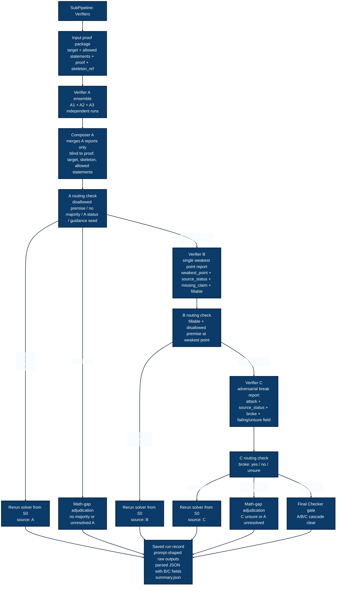

# SubPipeline: Verifiers

This visual maps the standalone verifier subpipeline. It shows where the current verifier cascade ends and what the real next protocol step should be.




## How To Read This Map

This is a map-style diagram. The curved arrows show which boxes correspond to which outcomes.

`STOPPED_*` statuses in `summary.json` mean the current verifier cascade ended at that stage. They do not necessarily mean the whole experiment stopped forever.

The real next move is recorded in:

```text
protocol_next_step
rerun_starts_at
current_cascade_action
```

Examples:

```json
{
  "status": "STOPPED_AFTER_B",
  "protocol_action": "RERUN_SOLVER_WITH_GUIDANCE",
  "protocol_source": "B",
  "protocol_next_step": "FRESH_MULTI_SOLVER_RUN_FROM_S0",
  "rerun_starts_at": "S0_BLUEPRINT",
  "current_cascade_action": "END_CURRENT_VERIFIER_CASCADE"
}
```

This means B ended the current verifier cascade, but the real next protocol step is a fresh solver rerun from S0.

```json
{
  "status": "COMPLETED_C_CLEAN",
  "protocol_next_step": "FINAL_CHECKER_GATE",
  "current_cascade_action": "CASCADE_CLEAR"
}
```

This means A/B/C cleared and the next real protocol step is the Final Checker gate.