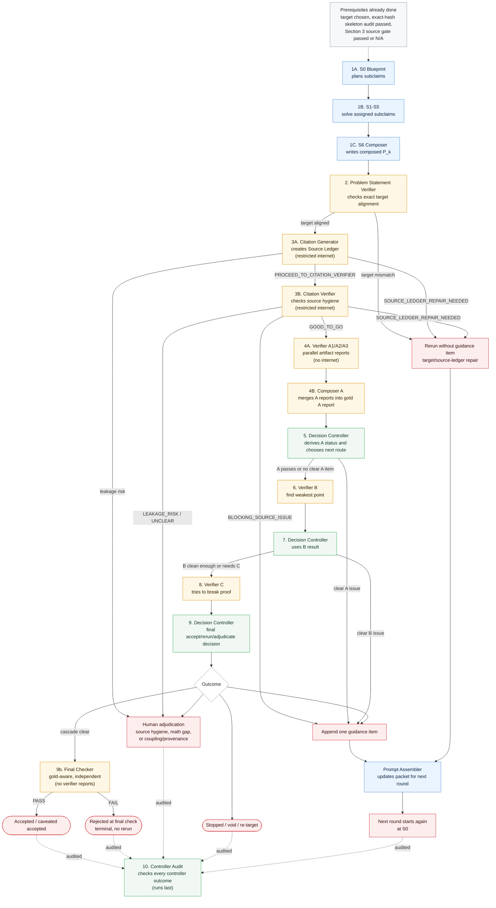
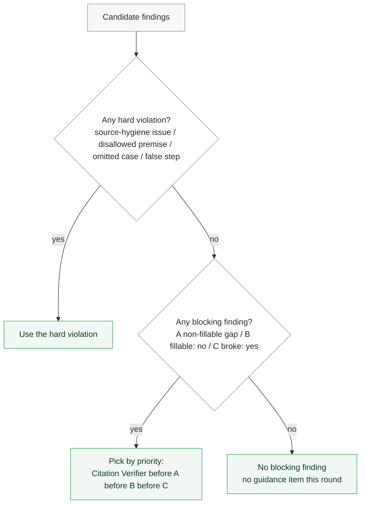

# PromptRIPS Pipeline Flowchart

This file is the operational map for the prompt protocol. It should be read alongside [Prompts.md](Prompts.md), which contains the exact prompt text and controller rules.

The first diagram shows the live agent handoff order. The second diagram gives the detailed setup, routing, rerun, audit, and final-check flow.

## Agent handoff map

This is the quick "who goes first, and who receives the output" view for the live agent run.
Setup, skeleton audit, and prompt assembly must already be done before this starts.

## Detailed protocol view including setup

```mermaid
flowchart TD
    classDef input fill:#f6f8fa,stroke:#8b949e,color:#24292f;
    classDef step fill:#eaf4ff,stroke:#4b8fd8,color:#0b2545;
    classDef audit fill:#fff7e6,stroke:#d99000,color:#332000;
    classDef decision fill:#ffffff,stroke:#8b949e,color:#24292f;
    classDef guidance fill:#f1f8f4,stroke:#2da44e,color:#12361f;
    classDef note fill:#fffaf0,stroke:#d0a85c,color:#3b2b00,stroke-dasharray:4 3;
    classDef terminal fill:#fdeeee,stroke:#d1242f,color:#3b0d0d;

    S1["STEP 1. Setup and hard gates<br/>Skeleton + target + tags + allowed statements + H_k"]:::step
    paperInput["Primary input: arXiv ID or URL"]:::input
    upstream["Paper Cleaner Steps 1-5<br/>download + flatten + index + select"]:::step
    build["Primary: Paper Cleaner Mini<br/>target-scoped proof-informed package"]:::input
    manualBuild["Fallback: manual full-paper<br/>proof-stripped skeleton"]:::input
    audit["Independent skeleton audit<br/>exact SHA-256 hard gate"]:::audit
    auditGate{"Self-contained, sufficient,<br/>leak-free, macro-clean,<br/>and hash-current?"}:::decision
    voidAudit(["VOID<br/>missing/failed skeleton audit"]):::terminal
    externalGate{"Section 3 contains<br/>external [Rn] grants?"}:::decision
    sourceGate["Skeleton Source Generator + Verifier<br/>restricted internet"]:::audit
    sourceStatus{"Every grant<br/>GOOD_TO_GO?"}:::decision
    voidSource(["STOP BEFORE SOLVER<br/>source gate failed or unclear"]):::terminal
    export["Deterministic export<br/>target.md + skeleton.md<br/>allowed_support.md + empty guidance.md"]:::input
    inputs["Current run inputs ready"]:::input

    S2["STEP 2. Prompt Assembler<br/>Fill fixed prompts with current inputs"]:::step
    solverPacket["Ready multi-solver packets<br/>S0/S1-S5/S6"]:::input
    verifierPacket["Ready Verifier packets<br/>include proposed proof P_k"]:::input

    S0["S0 Blueprint Solver<br/>fresh packet-selected mode"]:::step
    S15["S1-S5 Subproblem Solvers<br/>fresh packet-selected mode"]:::step
    S6["S6 Composer Solver<br/>fresh packet-selected mode<br/>produces composed P_k"]:::step
    sealed["Accepted branch proof registry<br/>E### statement enters H_k<br/>proof body remains sealed"]:::note
    finalAssembly["Deterministic final-only assembler<br/>hash-checks and attaches<br/>sealed branch proofs transitively"]:::step

    PSV["STEP 3A. Problem Statement Verifier<br/>checks P_k solves exact target"]:::audit
    PSVstatus{"Target aligned?"}:::decision
    CG["STEP 3B. Citation Generator<br/>creates Source Ledger<br/>restricted internet"]:::audit
    CGstatus{"Citation Generator result?"}:::decision
    CV["STEP 3C. Citation Verifier<br/>checks Source Ledger<br/>restricted internet"]:::audit
    CVstatus{"Citation gate?"}:::decision
    targetRerun["Rerun multi-solver system<br/>with exact target<br/>same H_k, no guidance item"]:::guidance
    citationRepair["Repair/rerun citation layer<br/>same H_k, no guidance item"]:::guidance
    guidanceCitation["Use Citation Verifier guidance<br/>substantive source issue"]:::guidance

    S4A["STEP 4A. Verifier A ensemble<br/>artifact-based reports"]:::step
    ensembleA["A1/A2/A3 fresh chats<br/>same artifact-based A prompt"]:::audit
    composer["Composer A<br/>gold A report<br/>reports only"]:::audit
    Agold["Composer A gold report<br/>gaps + disallowed premises<br/>scope + allowed coupling"]:::note
    Aderive["Decision Controller derives<br/>A status from Composer A"]:::guidance
    Astatus{"Derived A status?"}:::decision
    Amajority{"No majority<br/>in A ensemble?"}:::decision
    Aitem{"One clear<br/>A guidance seed?"}:::decision
    Aflag["A flagged issue<br/>no auto-accept"]:::note

    S4BC["STEP 4B. Verifier B/C layer<br/>run when A passes or A has no clear seed"]:::step
    VB["Verifier B<br/>weakest point"]:::audit
    VBstatus{"B status?"}:::decision
    VC["Verifier C<br/>break test"]:::audit
    VCstatus{"C broke?"}:::decision

    S5["STEP 5. Decision Controller<br/>apply hard gates, routing, and stopping rule"]:::step
    hard["Hard gates checked first<br/>setup, audit, leakage, target mismatch,<br/>source-hygiene issue, web, disallowed premise"]:::note
    coupling{"Paper-original<br/>and LOW allowed coupling?"}:::decision
    acceptRule["Cascade clear: target aligned + Citation Generator no leakage<br/>+ Citation Verifier GOOD_TO_GO<br/>+ A no non-fillable gap/disallowed, scope full<br/>+ B no weakest point or fillable: yes + C broke: no<br/>+ audit passed + not low-coupling paper-original"]:::note
    acceptGate{"Cascade clear?"}:::decision
    finalChecker["Final Checker (LLM)<br/>gold-aware, no internet<br/>sees gold+source, NOT verifier reports"]:::audit
    fcGate{"Final Checker?"}:::decision
    accept(["ACCEPTED"]):::terminal
    rejFinalD(["REJECTED at final check<br/>terminal, no rerun<br/>= cascade false-accept"]):::terminal
    caveat["Coupling/provenance adjudication<br/>caveated accept, re-target, or void<br/>no guidance item"]:::guidance
    acceptC(["ACCEPTED (caveated)<br/>low skeleton coupling, weak evidence"]):::terminal
    retarget(["Re-target / re-tag / void"]):::terminal
    hold["No auto-accept<br/>math-gap adjudication"]:::guidance
    citationAdj["Source-hygiene adjudication<br/>do not proceed to Verifier A"]:::guidance
    mathAdj["Math-gap adjudication<br/>pick one issue"]:::guidance
    sameSolver["Rerun multi-solver system once unchanged<br/>restart at Step 3"]:::guidance
    guidanceA["Use A guidance seed<br/>skip B/C"]:::guidance
    guidanceB["Use B guidance<br/>skip C"]:::guidance
    guidanceC["Use C guidance"]:::guidance
    budget{"H_k already has 10?"}:::decision
    stop(["STOP<br/>not reproduced within budget"]):::terminal
    oneItem["Append exactly one guidance item"]:::guidance
    log["Record controller log<br/>target/source gates + allowed-support difficulty<br/>citation internet use + leakage risk<br/>A1/A2/A3 + Composer + derived status<br/>coupling + decision + audit"]:::guidance
    ctlAudit["Controller Audit<br/>checks every controller outcome<br/>accept / rerun / adjudication / void"]:::guidance
    next(["Fresh multi-solver run<br/>with updated H_{k+1}<br/>restart at Step 2, then Step 3"]):::terminal

    S1 --> paperInput --> upstream --> build --> audit
    S1 --> manualBuild --> audit
    audit --> auditGate
    auditGate -->|"missing/fail"| voidAudit
    auditGate -->|"pass"| externalGate
    externalGate -->|"no"| export
    externalGate -->|"yes"| sourceGate --> sourceStatus
    sourceStatus -->|"no / unclear / leakage"| voidSource
    sourceStatus -->|"GOOD_TO_GO"| export
    export --> inputs

    inputs --> S2 --> solverPacket --> S0 --> S15 --> S6 --> finalAssembly --> PSV
    sealed --> finalAssembly
    sealed -.->|statement-only counted guidance| S2
    S2 --> verifierPacket

    PSV --> PSVstatus
    PSVstatus -->|"no / unclear blocking"| targetRerun
    PSVstatus -->|"yes"| CG
    CG --> CGstatus
    CGstatus -->|"PROCEED_TO_CITATION_VERIFIER"| CV
    CGstatus -->|"SOURCE_LEDGER_REPAIR_NEEDED"| citationRepair
    CGstatus -->|"leakage risk"| citationAdj
    CV --> CVstatus
    CVstatus -->|"GOOD_TO_GO"| verifierPacket
    verifierPacket --> S4A --> ensembleA --> composer --> Agold
    CVstatus -->|"SOURCE_LEDGER_REPAIR_NEEDED"| citationRepair
    CVstatus -->|"BLOCKING_SOURCE_ISSUE"| guidanceCitation
    CVstatus -->|"LEAKAGE_RISK / UNCLEAR"| citationAdj
    Agold --> Aderive --> Amajority

    Amajority -->|"no majority"| mathAdj
    Amajority -->|"majority holds"| Astatus
    Astatus -->|"VERIFIED / ALMOST VERIFIED"| S4BC
    Astatus -->|"NOT VERIFIED / INVALID"| Aitem
    Aitem -->|"yes"| guidanceA
    Aitem -->|"no"| Aflag --> S4BC

    S4BC --> VB --> VBstatus
    VBstatus -->|"weakest point + fillable: no, or disallowed premise"| guidanceB
    VBstatus -->|"no weakest point / fillable: yes"| VC
    VC --> VCstatus
    VCstatus -->|"broke: yes"| guidanceC
    VCstatus -->|"broke: unsure: choose issue"| mathAdj
    VCstatus -->|"broke: unsure: rerun unchanged"| sameSolver
    VCstatus -->|"broke: no"| S5

    S5 --> hard --> coupling
    Agold -.-> coupling
    coupling -->|"yes"| caveat
    caveat --> acceptC
    caveat --> retarget
    coupling -->|"no"| acceptRule --> acceptGate
    Aflag -.-> acceptGate
    acceptGate -->|"yes"| finalChecker --> fcGate
    fcGate -->|"PASS"| accept
    fcGate -->|"FAIL"| rejFinalD
    acceptGate -->|"no"| hold
    hold --> mathAdj

    guidanceA --> budget
    guidanceCitation --> budget
    guidanceB --> budget
    guidanceC --> budget
    mathAdj --> budget
    budget -->|"yes"| stop
    budget -->|"no"| oneItem --> log --> next
    targetRerun --> log
    citationRepair --> log
    citationAdj --> log

    accept -. audited .-> ctlAudit
    acceptC -. audited .-> ctlAudit
    rejFinalD -. audited .-> ctlAudit
    retarget -. audited .-> ctlAudit
    stop -. audited .-> ctlAudit
    next -. audited .-> ctlAudit
    sameSolver -. audited .-> ctlAudit
    targetRerun -. audited .-> ctlAudit
    citationRepair -. audited .-> ctlAudit
    citationAdj -. audited .-> ctlAudit
```

## Selection rule when several verifiers propose an item

Only one item is appended per round. The Decision Controller picks it by:

## Notes

- Primary protocol map: this FlowChart.md file is the main operational view of the protocol.
  The DECISION TREE block in Prompts.md is the synchronized textual companion for exact
  acceptance and routing details; if they disagree, pause and reconcile them before running.
- Every Solver and Verifier run is a fresh temporary chat (Markovian); the only state carried
  forward into a later Solver prompt is the cumulative guidance list. S0, S1-S5, and S6 are
  internal current-round solver chats. Their blueprint/subproof/composition artifacts may be
  inspected by verifiers for that round, but they are not carried into the next Solver round
  except through one explicitly counted guidance item.
- An accepted branch contributes one guidance item labeled E###: exact statement, independently
  verified status, permission to use without reproof, and use location. Its proof body, failed
  attempts, solver history, and verifier reports stay out of every later Solver prompt. After S6,
  deterministic code verifies the sealed proof hash and attaches the proof to the final artifact;
  nested accepted branch proofs are already included transitively. Missing or changed sealed
  artifacts stop before citation and proof verification.
- The Solver system is S0 blueprint, S1-S5 subproblem solvers, and S6 composer; together they
  produce the candidate proof. The final-only assembler then produces verifier-facing P_k by
  attaching any sealed accepted-branch proofs.
- Paper Cleaner Mini is the primary setup path. It produces a
  `target_scoped_proof_informed` package, which is a stronger and more targeted input condition
  than the manual full-paper skeleton fallback. Deterministic code, not another LLM, maps its
  audited seven sections to the solver input files.
- For a new public paper, the primary mathematical input is one arXiv ID or
  arxiv.org URL. The existing Paper Cleaner performs only Steps 1-5 to
  download and flatten the source, index statements and proofs, analyze
  dependencies, and select `mains` plus `hardest`. Its older package and
  verification stages do not run; Paper Cleaner Mini owns package generation.
- `Prompts.md` keeps Solver chats no-internet; `PromptsWithFullInternet.md` runs S0-S6 in
  source-supported internet mode. Verifier A/B/C remain no-internet in both modes. The Skeleton
  Source Generator/Verifier and post-proof Citation Generator/Verifier are restricted-internet
  source-checking roles.
- The Problem Statement Verifier checks that the candidate artifact P_k, and any verifier/checker report
  that needs checking, addresses the exact target theorem. A mismatch reruns the affected agent
  with the exact target and does not append mathematical guidance.
- Citation Generator creates a Source Ledger and Citation Verifier checks source hygiene before
  Verifier A runs. Both citation roles may use internet access only for source checking: common
  theorem names, standard background facts, textbook-level references, named inequalities,
  named identities, exact statements of cited theorems, and whether a claimed standard result is
  actually standard. They must not search for the target theorem, target label, original target
  source, target proof, distinctive target phrases, or any original proof or solution.
- Verifier A1/A2/A3 do not run until Citation Verifier returns GOOD_TO_GO and no citation-role
  leakage risk is present. Source-ledger repair reruns the citation layer with the same H_k and
  no new guidance item; a substantive source issue can become the one guidance item for the
  next round.
- Citation Generator and Citation Verifier reports are controller-visible only. They are not
  passed to future Solver runs except through one explicitly counted standalone guidance item.
- A recorded passing skeleton audit bound to the exact skeleton SHA-256 is a hard gate. Missing,
  failed, or hash-stale audit results void the run before Solver scoring; this is not counted as
  a proof failure. A nonempty Section 3 additionally requires a GOOD_TO_GO skeleton source gate.
- Run interpretation is a set of tags, not a single label. For example, a run can be both
  `protocol_validation` and `cited_prior_result`.
- Run tags are fixed at setup before the Solver runs; they must not be edited based on verifier
  output. In particular, the `paper_original_result` tag may not be dropped after seeing the
  coupling assessment.
- In the current Prompts.md, Verifier A1/A2/A3 are artifact-based. They report gaps, disallowed premises, scope coverage,
  false reproduced steps, allowed coupling, and disallowed citations. They do not emit the final
  verdict word, confidence, seriousness, or "obvious and decisive" label.
- The Decision Controller derives Verifier A's status from Composer A's gold report from the required A1/A2/A3 ensemble.
- Verifier B and C are also field-based: B reports whether a weakest point was found plus
  `fillable: yes/no/not applicable`; C reports the attack plus `broke: yes/no/unsure`. Neither emits severity,
  seriousness, confidence, or a verdict word; the Decision Controller routes on fillable/broke.
- The Final Checker is a privileged, gold-aware LLM referee that runs LAST, only after the
  gold-blind A/B/C cascade is clear and no coupling override fires. It sees the gold proof and
  source but NOT the verifier reports, Composer output, or controller opinion (independence;
  this avoids calibration circularity), and runs with no internet at temperature 0. PASS =
  ACCEPTED; FAIL = terminal rejection with explanation and NO rerun or guidance item. A
  cascade-clear proof that FAILS the Final Checker is a logged false-accept of the A/B/C cascade.
- Composer A is required for the current Verifier A layer. It sees only the Verifier A reports, not the proof, skeleton,
  target theorem, or allowed supporting statements. It preserves every issue any A run flagged and
  surfaces disagreement instead of majority-voting problems away.
- Disallowed skeleton citations are violations. They are recorded separately and do not count as
  positive proof-skeleton coupling.
- Proof-skeleton coupling is computed from the allowed part of Verifier A's artifact report. For
  paper-original targets, LOW allowed coupling routes to coupling/provenance adjudication even if
  A/B/C otherwise pass.
- Coupling/provenance adjudication has exits only: caveated accept, re-target/re-tag, or void. It
  does not append mathematical guidance, because there is no math gap to fix and guidance toward a
  skeleton statement would steer the Solver.
- Training-data leakage and unbounded "standard background" are treated as the same
  provenance-risk problem; the coupling check is the controller-level mitigation.
- Out-of-loop feedback from another model or a human is protocol review, not in-loop
  heterogeneous verification. To affect acceptance, a different model or human checkpoint must run
  inside the verifier cascade with the same structured fields.
- Solver chats see their assigned solver packet(s). Verifier chats see their verifier packet,
  which also includes the proposed proof artifact P_k. They do not see the operating rules, decision tree, controller log,
  paper metadata, or arXiv URL.
- The accept/reject combination, the one-item selection, and the stopping rule live in the
  external controller log, not in any Solver or Verifier prompt.
- Controller Audit is a checking step for whether the Decision Controller followed the protocol.
  In the long run, the Decision Controller should become deterministic code rather than an LLM
  discretion layer.
- This chart shows the controller-level loop. The run log should still record the paper ID,
  target theorem, run tags, target scope, skeleton filenames and checksum, skeleton audit and
  pre-solver external-grant gate status,
  solver output, verifier outputs, Composer A output, derived A status, allowed coupling,
  disallowed citations, Decision Controller outcome, Controller Audit result, web-source audit,
  acceptance decision, and any appended guidance item.
