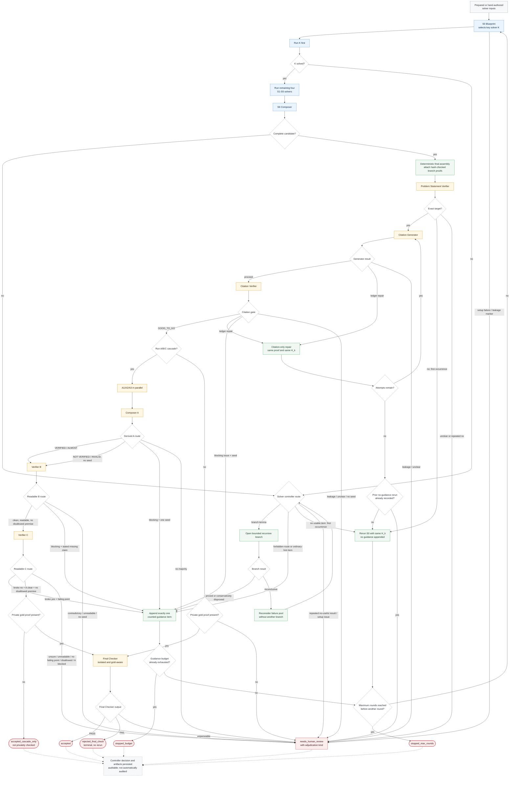
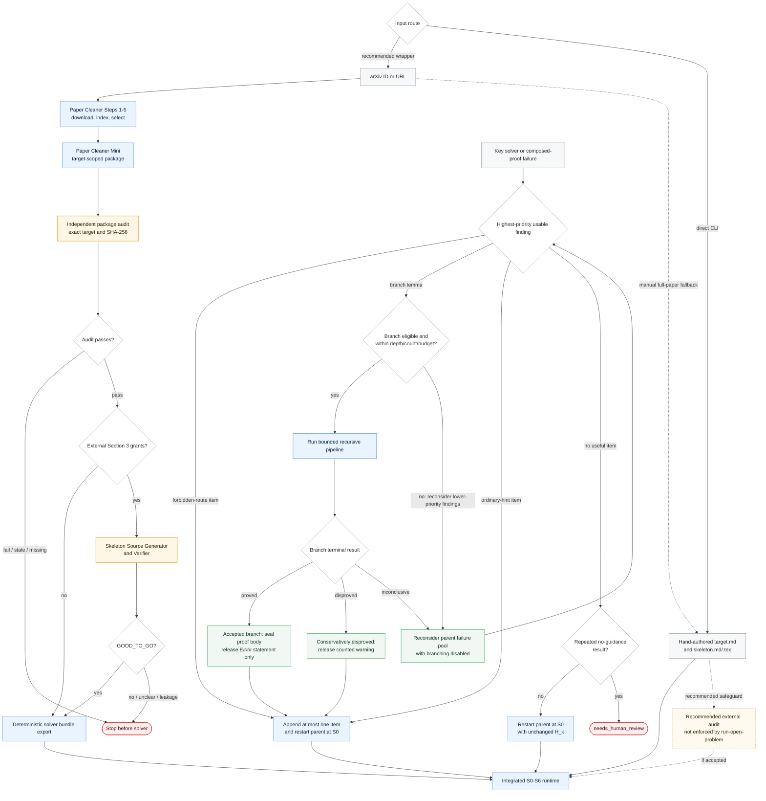
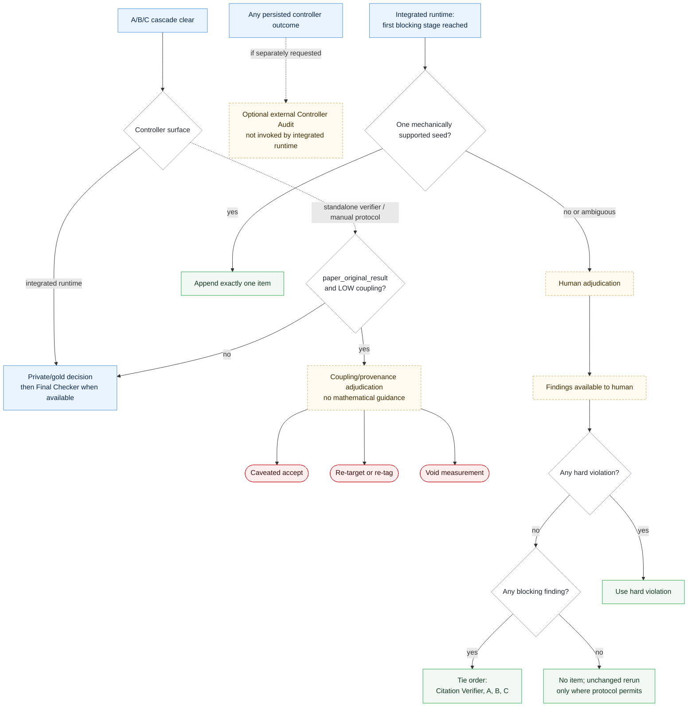

  <picture>
    <source media="(prefers-color-scheme: dark)" srcset="../docs/rips-proof-mark-dark.png">
    <source media="(prefers-color-scheme: light)" srcset="../docs/rips-proof-mark.png">
    
  </picture>

<h1 align="center">PromptRIPS Protocol Flow</h1>

  <strong>Operational order, evidence gates, rerun paths, and terminal outcomes.</strong>

  <a href="../README.md">Project home</a> ·
  <a href="README.md">Prompt protocol</a> ·
  <a href="Prompts.md">No-internet packet</a> ·
  <a href="PromptsWithFullInternet.md">Source-supported packet</a>

> 🧭 **Reading guide:** Start with the one-minute table, then open the
> integrated-runtime map for the exact automated route. Dashed arrows in the
> later diagrams are manual or standalone-protocol paths; the integrated
> `solver/` runtime does not execute them automatically.

## Protocol in one minute

| Phase | What happens | Live implementation boundary |
|---:|---|---|
| **1. Prepare** | Paper Cleaner selects the target; Mini builds and audits the public packet; the Section 3 source gate runs when needed | arXiv wrappers prepare Steps 1-5; `run-cleaner-solver` starts from that prepared paper and enforces Mini/audit/source gates; hand-authored `run-open-problem` inputs bypass setup gates |
| **2. Reconstruct** | S0 plans and selects one key solver; that solver must pass before the other four S1-S5 roles and S6 run | automated by `solver/orchestrator.py` |
| **3. Validate sources** | Problem Statement Verifier checks the exact target; Citation Generator/Verifier check the source ledger | automated before mathematical verification |
| **4. Review mathematics** | A1/A2/A3 review independently; Composer A merges; B finds the weakest point; C attacks it | automated with conservative human-review exits for malformed or contradictory reports |
| **5. Decide** | The deterministic controller accepts, reruns, branches, requests human review, stops, or invokes the private Final Checker | public-only runs can reach `accepted_cascade_only`; private runs require Final Checker PASS for `accepted` |
| **6. Extend or audit** | Coupling/provenance adjudication and Controller Audit remain available in the written protocol | coupling exists in the standalone verifier package; Controller Audit is external/manual, not invoked by the integrated runtime |

### Authority boundary

- [Prompts.md](Prompts.md) and
  [PromptsWithFullInternet.md](PromptsWithFullInternet.md) define the role
  contracts and full manual protocol.
- `Individual Pipeline/solver/*.py` defines what the integrated command-line
  runtime actually executes.
- A persisted controller decision is **auditable**, but it is not
  **independently audited** unless a separate Controller Audit is run.
- The terminal `state.json` status and the gates that actually ran are the
  authoritative result of an automated run.

## Choose a view

<strong>1. Integrated runtime map</strong> — exact automated order and exits

This is the route executed by `python -m solver run-open-problem`. Setup gates
are guaranteed only when the input bundle came through `run-cleaner-solver`.
Both prompt packets use the key-solver-first schedule shown below.

<strong>2. Setup and branch detail</strong> — enforced and optional entry paths

Solid arrows are enforced by the integrated wrapper or solver runtime. Dashed
arrows are recommended manual safeguards or prompt-protocol operations.

## Protocol-only extensions and guidance selection

The next view deliberately separates paths that the integrated runtime executes
from paths that still require the standalone verifier package or a human
operator.

<strong>3. Manual extensions and one-item policy</strong> — no hidden automation

## Operational invariants

| Rule | Boundary that must remain true |
|---|---|
| **Fresh contexts** | Solver and verifier roles run in fresh temporary chats; only controller-approved counted guidance crosses rounds. |
| **Key solver first** | S0 designates one key solver; the other four S1-S5 roles and S6 wait until it reports `solved`. |
| **One-item state** | At most one guidance item is appended per ordinary rerun; target and citation repairs do not create mathematical guidance. |
| **Citation-only repair** | Source-ledger repair retries the citation layer on the same proof and same `H_k` before any unchanged full solver rerun. |
| **Sealed branch proofs** | Later solvers receive the accepted statement and permission, not the branch proof body; deterministic assembly releases the hash-checked proof only at the end. |
| **Source before mathematics** | Target and citation/source gates clear before A1/A2/A3 run. |
| **Controller owns outcomes** | Model roles report structured findings; deterministic routing and the recorded terminal status determine the workflow outcome. |
| **Final Checker isolation** | When private material is present, the gold-aware Final Checker runs last without internet or verifier/controller opinions; FAIL is terminal and malformed output requires human review. |
| **Public-only boundary** | Without private gold material, a clear cascade ends as `accepted_cascade_only`, never `accepted` or “privately checked.” |
| **Audit semantics** | Runtime decisions are persisted for audit. Controller Audit and coupling/provenance adjudication are not automatic integrated-runtime stages. |

<strong>Full protocol notes</strong> — implementation and interpretation rules

### Full protocol notes

- This file separates the integrated runtime from the fuller manual protocol. The DECISION TREE
  block in Prompts.md remains the authority for manual role contracts; the integrated-runtime
  map above follows the checked-in Python controller. Do not present a manual-only edge as an
  automated stage.
- Every Solver and Verifier run is a fresh temporary chat (Markovian); the only state carried
  forward into a later Solver prompt is the cumulative guidance list. S0, S1-S5, and S6 are
  internal current-round solver chats. Their blueprint/subproof/composition artifacts may be
  inspected by verifiers for that round, but they are not carried into the next Solver round
  except through one explicitly counted guidance item.
- An accepted branch contributes one guidance item labeled E###: exact statement, independently
  verified status, permission to use without reproof, and use location. Its proof body, failed
  attempts, solver history, and verifier reports stay out of every later Solver prompt. After S6,
  deterministic code verifies the sealed proof hash and attaches the proof to the final artifact;
  nested accepted branch proofs are already included transitively. Missing or changed sealed
  artifacts stop before citation and proof verification.
- The Solver system is S0 blueprint, S1-S5 subproblem solvers, and S6 composer. S0 designates
  exactly one key solver in S1-S5; that solver runs first, and the other four plus S6 are skipped
  when it does not report `solved`. After a complete S6 result, the final-only assembler produces
  verifier-facing P_k by attaching any sealed accepted-branch proofs.
- Paper Cleaner Mini is the primary setup path. It produces a
  `target_scoped_proof_informed` package, which is a stronger and more targeted input condition
  than the manual full-paper skeleton fallback. Deterministic code, not another LLM, maps its
  audited seven sections to the solver input files.
- For a new public paper, the primary mathematical input is one arXiv ID or
  arxiv.org URL. The existing Paper Cleaner performs only Steps 1-5 to
  download and flatten the source, index statements and proofs, analyze
  dependencies, and select `mains` plus `hardest`. Its older package and
  verification stages do not run; Paper Cleaner Mini owns package generation.
- `Prompts.md` keeps Solver chats no-internet; `PromptsWithFullInternet.md` runs S0-S6 in
  source-supported internet mode. Verifier A/B/C remain no-internet in both modes. The Skeleton
  Source Generator/Verifier and post-proof Citation Generator/Verifier are restricted-internet
  source-checking roles.
- The Problem Statement Verifier checks that candidate artifact P_k addresses the exact target.
  In the integrated runtime, a clear first mismatch reruns S0-S6 unchanged; a repeated mismatch
  or an `UNCLEAR` report requires human target-alignment review. No path appends mathematical
  guidance for a target repair. The manual protocol may also apply this check to verifier or
  checker reports.
- Citation Generator creates a Source Ledger and Citation Verifier checks source hygiene before
  Verifier A runs. Both citation roles may use internet access only for source checking: common
  theorem names, standard background facts, textbook-level references, named inequalities,
  named identities, exact statements of cited theorems, and whether a claimed standard result is
  actually standard. They must not search for the target theorem, target label, original target
  source, target proof, distinctive target phrases, or any original proof or solution.
- Verifier A1/A2/A3 do not run until Citation Verifier returns GOOD_TO_GO and no citation-role
  leakage risk is present. Source-ledger repair first reruns the Citation Generator/Verifier layer
  on the same proof and same H_k, up to the configured attempt limit. An exhausted first repair
  result triggers an unchanged full solver rerun; a repeated no-guidance result requires human
  source-hygiene review. A substantive source issue can become the one guidance item.
- Citation Generator and Citation Verifier reports are controller-visible only. They are not
  passed to future Solver runs except through one explicitly counted standalone guidance item.
- A recorded passing skeleton audit bound to the exact skeleton SHA-256 is a hard gate for the
  recommended `run-cleaner-solver` path. Missing, failed, or hash-stale audit results stop that
  path before Solver scoring; a nonempty Section 3 additionally requires a GOOD_TO_GO source
  gate. The lower-level `run-open-problem` command accepts hand-authored inputs and does not
  enforce these setup records, so those inputs must not be described as cleaner-audited.
- Run interpretation is a set of tags, not a single label. For example, a run can be both
  `protocol_validation` and `cited_prior_result`.
- Run tags are fixed at setup before the Solver runs; they must not be edited based on verifier
  output. In particular, the `paper_original_result` tag may not be dropped after seeing the
  coupling assessment.
- In the current Prompts.md, Verifier A1/A2/A3 are artifact-based. They report gaps, disallowed premises, scope coverage,
  false reproduced steps, allowed coupling, and disallowed citations. They do not emit the final
  verdict word, confidence, seriousness, or "obvious and decisive" label.
- The Decision Controller derives Verifier A's status from Composer A's gold report from the required A1/A2/A3 ensemble.
- Verifier B and C are also field-based: B reports whether a weakest point was found plus
  `fillable: yes/no/not applicable`; C reports the attack plus `broke: yes/no/unsure`. Neither emits severity,
  seriousness, confidence, or a verdict word; the Decision Controller routes on fillable/broke.
- The Final Checker is a privileged, gold-aware LLM referee that runs LAST when private gold
  material is present. It sees the gold proof and source but NOT verifier reports, Composer
  output, or controller opinion, and runs with no internet at temperature 0. PASS = `accepted`;
  FAIL = terminal `rejected_final_check` with no rerun or guidance item; malformed output requires
  human review. Without private gold, a clear cascade ends as `accepted_cascade_only`, which is
  not a private correctness certification.
- Composer A is required for the current Verifier A layer. It sees only the Verifier A reports, not the proof, skeleton,
  target theorem, or allowed supporting statements. It preserves every issue any A run flagged and
  surfaces disagreement instead of majority-voting problems away.
- Disallowed skeleton citations are violations. They are recorded separately and do not count as
  positive proof-skeleton coupling.
- The full prompt protocol and standalone verifier package can compute proof-skeleton coupling.
  For paper-original targets, LOW allowed coupling routes there to coupling/provenance
  adjudication even if A/B/C otherwise pass. The integrated S0-S6 runtime does not currently load
  this metadata or execute that override; its diagram therefore marks the edge as non-automatic.
- Coupling/provenance adjudication has exits only: caveated accept, re-target/re-tag, or void. It
  does not append mathematical guidance, because there is no math gap to fix and guidance toward a
  skeleton statement would steer the Solver.
- Training-data leakage and unbounded "standard background" are treated as the same
  provenance-risk problem; the coupling check is the controller-level mitigation.
- Out-of-loop feedback from another model or a human is protocol review, not in-loop
  heterogeneous verification. To affect acceptance, a different model or human checkpoint must run
  inside the verifier cascade with the same structured fields.
- Solver chats see their assigned solver packet(s). Verifier chats see their verifier packet,
  which includes proposed proof artifact P_k and is therefore built only after final assembly.
  The manual Prompt Assembler prepares ready-to-paste packets; the integrated runtime renders
  those prompts dynamically. Verifiers do not see the operating rules, decision tree, controller
  log, paper metadata, or arXiv URL.
- The accept/reject combination, one-item selection, and stopping rule live in deterministic
  controller code for integrated runs and in the external controller log for manual runs; they do
  not live in any Solver or Verifier prompt.
- Controller Audit is an optional independent check of whether the Decision Controller followed
  the protocol. The integrated runtime persists every controller decision but does not invoke the
  Controller Audit role. If that role is run externally, record its result without relabeling a
  merely persisted decision as independently audited.
- This chart shows the controller-level loop. The run log should still record the paper ID,
  target theorem, run tags, target scope, skeleton filenames and checksum, skeleton audit and
  pre-solver external-grant gate status,
  solver output, verifier outputs, Composer A output, derived A status, allowed coupling,
  disallowed citations, Decision Controller outcome, Controller Audit result if separately run, web-source audit,
  acceptance decision, and any appended guidance item.

