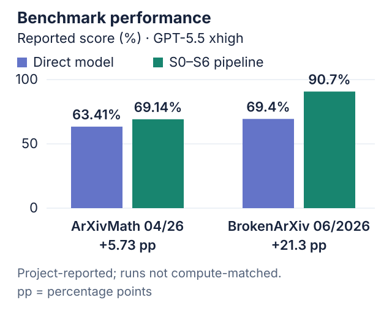

<p align="center">
  <picture>
    <source media="(prefers-color-scheme: dark)" srcset="docs/rips-proof-mark-dark.png">
    <source media="(prefers-color-scheme: light)" srcset="docs/rips-proof-mark.png">
    
  </picture>
</p>

<h1 align="center">RIPS Proof Pipeline</h1>

<p align="center">
  <strong>Reconstruct proofs from mathematics papers with a team of AI solvers.</strong>
</p>

<p align="center">
  
  <a href=".github/workflows/ci.yml"></a>
  
  
</p>

<p align="center">
  <a href="#start-here-a-worked-example">Worked example</a> ·
  <a href="#quick-start">Quick start</a> ·
  <a href="#how-the-pipeline-works">Architecture</a> ·
  <a href="#evidence-and-results">Results</a> ·
  <a href="#documentation-map">Documentation</a> ·
  <a href="#scope-and-claim-boundary">Limitations</a>
</p>


## Why this project exists

A theorem often depends on definitions and earlier results scattered across a
paper. We collect the context a solver is allowed to use, withhold the target's
proof, and ask a team of AI solvers to reconstruct it.

The team plans the argument, works through its parts, and writes a complete
candidate. Separate reviewers check the statement, sources, and mathematics.
Runs save stage outputs, review reports, and controller decisions so you can
follow what happened. The worked example also includes the public role prompts
and inputs.

This is research software. The reviews use language models, not formal proof
verification.

## Start here: a worked example

We used **GPT-5.5 xhigh with Codex subagents** to work through a classical form
of Cayley's formula. The run produced a proof in one round, without additional
hints, and passed its proof reviews, including the private Final Checker.

[Follow the worked example](Examples/cayley/README.md) to see what each stage
received and produced. It includes a diagram, a two-page proof, and a small
check you can run locally. This example used Codex agents directly; the
commands below use the Python runtime.

## Quick start

### 1. Install the editable research package

You need Python 3.9 or newer.

```bash
git clone https://github.com/GrgAakash/RIPS-Proof-Pipeline.git
cd RIPS-Proof-Pipeline
python3 -m venv .venv
source .venv/bin/activate
python -m pip install --upgrade pip
python -m pip install -e '.[pipeline]'
```

### 2. Run a free offline verifier demo

Try the review workflow with fixed mock responses. No API key is needed:

```bash
python -m verifiers run-mock \
  --scenario clean \
  --target-theorem 'For every integer n, n = n.' \
  --allowed-supporting-statements 'Equality reflexivity is allowed.' \
  --proof-artifact 'For every integer n, n = n by equality reflexivity.' \
  --skeleton-ref 'skeleton.tex#reflexivity'
```

The demo saves its files under `Outputs/verifier/`, which Git ignores.

### 3. Run the offline regression suite

```bash
PYTHONPATH='Individual Pipeline' \
  python -m unittest discover -s tests -p 'test*.py'
```

These tests run offline. Install `.[pipeline]` first so the cleaner tests run
too; without it, the target-integrity test module is skipped.

## How the pipeline works

| Phase | What happens | Output |
|---|---|---|
| Prepare — Paper Cleaner Steps 1–5 | Read the paper and select an exact theorem | theorem and source record |
| Package — Paper Cleaner Mini | Choose and check the context for that theorem | solver input packet |
| Reconstruct | S0 plans, S1-S5 solve parts, and S6 writes the proof | candidate proof |
| Validate | Check the target statement and cited sources | statement and citation reports |
| Verify | A1/A2/A3 review the proof; Composer A combines their findings; B and C challenge it | proof reviews |
| Decide | Choose whether to retry, stop, or run the optional private reference check | final run status |

The cleaners work together: Paper Cleaner selects the theorem; Mini prepares
its context. The current workflow switches to Mini after Step 5; the older
Steps 6–8 remain available for standalone cleaner runs. See the
[cleaner comparison](Individual%20Pipeline/paper_cleaner/README.md#paper-cleaner-versus-paper-cleaner-mini).

Mini can read the original proof while choosing that context. The solver
cannot: its packet is checked for proof leakage before use. This distinction
matters when interpreting reconstruction results.

Choose one of two prompt sets:

- [`Prompt Packet/Prompts.md`](Prompt%20Packet/Prompts.md): S0-S6 operate
  without hosted web search.
- [`Prompt Packet/PromptsWithFullInternet.md`](Prompt%20Packet/PromptsWithFullInternet.md):
  S0-S6 may use hosted web search.

In both modes, the pre-solver source gate and post-proof citation gate may use
restricted source checking. Proof verifiers and the private Final Checker do
not browse.

The [prompt guide](Prompt%20Packet/README.md) explains the roles, and the
[flow chart](Prompt%20Packet/FlowChart.md) shows their order.

## Use with Codex subagents

You can use Codex in two ways. In the [worked example](Examples/cayley/README.md),
a parent agent runs the protocol through fresh subagents without starting the
Python runtime. The prompt below instead asks Codex to operate that runtime.

Current Codex clients can delegate independent work to
[subagents](https://learn.chatgpt.com/docs/agent-configuration/subagents).
For a runtime-backed run, subagents can check the inputs and review the outputs.
The Python controller runs S0-S6, saves the files, and decides what happens next.
Do not start a second copy of the solver workflow in Codex while Python is
already running it.

Open the repository in Codex and adapt this prompt:

```text
Operate the proof pipeline in this repository.

Run mode: <full pipeline or solver-only>
Input: <paper ID and target ID, or solver-input directory>
Prompt mode: <no-internet or full-internet>
Run name: <name>

Use the selected canonical prompt packet and follow its S0-S6 execution order.
Use read-only subagents for two independent preflight checks: one must validate
the input files and exact target statement; the other must check the selected
prompt mode, privacy boundary, and output location. Wait for both and resolve
any blocking finding before running the pipeline.

The checked-in Python runtime is the authoritative orchestrator. Do not manually
re-run S0-S6 or the verifier cascade in a second orchestration layer. Before any
paid API call, show me the exact command, model, solver web mode, private Final
Checker setting, and output directory, then wait for approval.

After the run reaches a terminal status, use separate read-only subagents to
audit (1) the terminal controller status and gates that actually ran and (2) the
proof, citation, and verifier artifacts. Wait for both, then report the exact
status, artifact paths, and unresolved gates. Never describe a candidate,
partial, or verifier-only result as privately checked or proved.
```

Codex subagents share the parent session's permissions and consume additional
tokens. Keep their assignments bounded and avoid parallel edits to the same
files. The repository does not currently expose Codex subagents as an alternate
backend for its internal model calls; `--solver-workers` controls the runtime's
own parallel S1-S5 API calls.

## Run a paper through the pipeline

API-backed runs incur model usage. Keep credentials in environment variables;
never place them in tracked files.

### Prepare the source and choose a target

```bash
export OPENAI_API_KEY='...'
ARXIV=2606.16585 ./Commands/prepare_paper_input.sh
```

Open `Inputs/paper_cleaner_input/<paper-id>/roles/selection.json` and choose a
`stmt-...` target ID. Each ID points to a statement in the paper's source; it is
not a guessed theorem number.

The `stmt-a83f71c209d4` ID below is illustrative: replace it with an ID from
your paper's `selection.json` before running either command.

### Closed-book S0-S6

```bash
PAPER_ID=2606.16585 \
TARGET_ID=stmt-a83f71c209d4 \
RUN_NAME=2606.16585_stmt-a83f71c209d4_no_internet \
  ./Commands/run_no_internet.sh
```

### Source-supported S0-S6

```bash
PAPER_ID=2606.16585 \
TARGET_ID=stmt-a83f71c209d4 \
RUN_NAME=2606.16585_stmt-a83f71c209d4_full_internet \
  ./Commands/run_full_internet.sh
```

These wrappers enable the private Final Checker by default. It receives the
reference proof and full paper source in an ignored directory, separate from
the solver. Set `INCLUDE_PRIVATE_FINAL_CHECKER=0` to skip that check; the
strongest result is then `accepted_cascade_only`.

See the [command guide](Commands/README.md) for settings and costs.

## Run a hand-authored solver packet

To skip both cleaners, create a directory under `Inputs/solver_input/`:

```text
Inputs/solver_input/my_problem/
  target.md             exact theorem to prove
  skeleton.md           public definitions, assumptions, and granted results
  allowed_support.md     explicit boundary on permitted premises
  guidance.md            optional; one guidance item per non-empty line
  bibliography.bib       optional; used by the citation gate
```

Check that the packet loads with a mock run:

```bash
python -m solver run-open-problem \
  --problem-dir Inputs/solver_input/my_problem \
  --run-dir Outputs/solver_only_mock \
  --packet-file 'Prompt Packet/Prompts.md' \
  --client mock \
  --max-rounds 1 \
  --max-branch-depth 0 \
  --max-branches 0
```

This checks file loading and workflow, not the proof. The
[input guide](Inputs/solver_input/README.md) explains each file and the checks
that a hand-authored packet skips.

## Reading a run

For `RUN_NAME=my_run`, begin with:

```text
Inputs/solver_input/my_run/solver_input/  exported solver-ready input
Outputs/my_run/cleaner/           cleaner and audit evidence
Outputs/my_run/solver/            solver state, rounds, and verifier evidence
```

Start with `state.json` to see how the run ended, then open the relevant files:

- `candidate_final_proof.md`: S6's proposed proof before final assembly;
- `final_proof.md`: assembled proof used by downstream gates;
- `problem_statement_verifier.md`: exact-target check;
- `citation_gate/`: source ledger, reports, and citation decision;
- `verifier_a1.md` through `verifier_c.md`: mathematical review chain;
- `state.json`: terminal status and the gates actually reached.

Accepted branch proofs additionally produce `PROOF_GUIDE.md`,
`proof_registry.json`, and `proof_modules/`. See
[`Outputs/README.md`](Outputs/README.md) for the complete navigation guide.

## Evidence and results

We evaluated the S0–S6 solver workflow on **ArXivMath** and **BrokenArXiv**,
comparing pipeline-assisted performance with direct use of **GPT-5.5 xhigh**.



| Benchmark | Direct model | S0–S6 pipeline | Difference |
|---|---:|---:|---:|
| ArXivMath 04/26 | 63.41% | 69.14% | +5.73 percentage points |
| BrokenArXiv 06/2026 | 69.4% | 90.7% | +21.3 percentage points |

*These are project-reported scores. The two approaches were not given matching
compute budgets.*

Explore [43 selected BrokenArXiv runs](Results/brokenarxiv/runs/) for examples
of the inputs, solver prompts, and outputs. These are solver-only records;
see the [evaluation notes](Results/brokenarxiv/README.md) for budgets and limits.

We also tested paper-proof reconstruction **with context** (paper-specific
background and supporting statements) and **without context** (the target and
essential definitions, but no supplied supporting lemmas). The final reports
record **23/31 passes with context (74.2%; 21 automated + 2 manual)** and
**15/31 without context (48.4%; all automated)**. See the
[paper-reproduction results](Results/paper_reproduction/README.md) for details
and links to the tested papers, or the
[paired subject breakdown](Results/paper_reproduction/paired_outcomes.md) for
targets that passed only with context, only without it, in both, or in neither.

## Documentation map

| If you want to… | Start here |
|---|---|
| See a real run, stage by stage | [Cayley's-formula worked example](Examples/cayley/README.md) |
| Understand the complete architecture | [`SOURCE_MAP.md`](SOURCE_MAP.md) |
| Read the operational protocol | [`Prompt Packet/FlowChart.md`](Prompt%20Packet/FlowChart.md) |
| Compare solver internet modes | [`Prompt Packet/README.md`](Prompt%20Packet/README.md) |
| Prepare or run a paper | [`Commands/README.md`](Commands/README.md) |
| Author a solver-only packet | [`Inputs/solver_input/README.md`](Inputs/solver_input/README.md) |
| Interpret run artifacts | [`Outputs/README.md`](Outputs/README.md) |
| Inspect cleaner internals | [`paper_cleaner/README.md`](Individual%20Pipeline/paper_cleaner/README.md) |
| Inspect the target-scoped cleaner | [`paper_cleaner_mini/README.md`](Individual%20Pipeline/paper_cleaner_mini/README.md) |
| Compare with-context and without-context results | [`Results/paper_reproduction/README.md`](Results/paper_reproduction/README.md) |
| Inspect the public benchmark export | [`Results/brokenarxiv/README.md`](Results/brokenarxiv/README.md) |
| Contribute or report a problem | [`CONTRIBUTING.md`](CONTRIBUTING.md) |

## Repository layout

```text
Individual Pipeline/     editable implementation components
  paper_cleaner/         full-paper ingestion and target selection
  paper_cleaner_mini/    target-scoped author/check/repair workflow
  solver/                S0-S6 orchestration and deterministic routing
  citation/              post-S6 citation generation and verification
  verifiers/             isolated A1/A2/A3, Composer A, B, and C tools
Prompt Packet/           canonical prompts and operational flowchart
Commands/                stable shell entry points
Inputs/                  ignored local input workspaces
Outputs/                 ignored local run workspaces
Examples/                guided, reviewed worked examples
Results/                 deliberately reviewed public evaluation artifacts
tests/                   offline regression suite
docs/                    README presentation assets
.github/                 CI and issue templates
```

Canonical prompt packets are edited by hand. Component-level prompt views are
generated and checked for drift:

```bash
python prompt_sync.py --write
python prompt_sync.py --check
```

## Scope and claim boundary

- The pipeline reconstructs proofs of results supplied by source papers.
- The experimental professor-supplied open-problem workflow is not included.
- A generated proof, a cascade-only pass, and a private Final Checker pass are
  different outcomes. Check the recorded status before reporting a result.
- Hand-authored packets skip the cleaner, package audit, and pre-solver source
  checks.
- The private Final Checker sees reference material that must stay out of
  solver inputs and public reports.
- API runs use paid model calls. Review the model, internet setting, private
  inputs, and output directory before starting.

## Project provenance and contributors

This repository is a cleaned public release of the collaborative RIPS-LA 2026
project sponsored by OpenAI. The team developed it in an earlier shared
repository, so this commit history covers only the public release. See
[CONTRIBUTORS.md](CONTRIBUTORS.md) for the team, mentors, and final report, or
[CITATION.cff](CITATION.cff) to cite the project.

Questions and reproducible bug reports are welcome through GitHub Issues. When
reporting a run, include the command, prompt mode, terminal status, and relevant
artifact paths, but never attach API keys, private paper text, or gold proofs.

## License

The project's original code, prompts, and documentation are licensed under the
[MIT License](LICENSE). You may use, modify, and redistribute them, including
commercially, while preserving the copyright and license notices.

Third-party papers, benchmark material, and source excerpts retain their original
rights and terms. This license does not grant additional rights to those materials.
