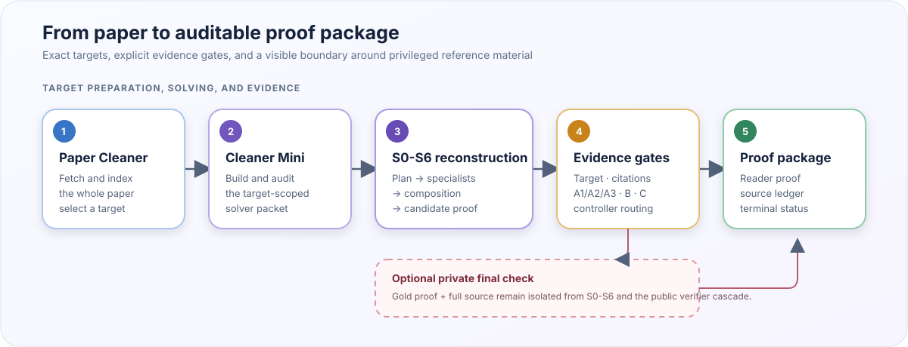

<p align="center">
  <picture>
    <source media="(prefers-color-scheme: dark)" srcset="docs/rips-proof-mark-dark.png">
    <source media="(prefers-color-scheme: light)" srcset="docs/rips-proof-mark.png">
    
  </picture>
</p>

<h1 align="center">RIPS Proof Pipeline</h1>

<p align="center">
  <strong>Source-grounded proof reconstruction and evidence packaging for mathematical research papers.</strong>
</p>

<p align="center">
  
  <a href=".github/workflows/ci.yml"></a>
  
  
</p>

<p align="center">
  <a href="#quick-start">Quick start</a> ·
  <a href="#how-the-pipeline-works">Architecture</a> ·
  <a href="#evidence-and-results">Results</a> ·
  <a href="#documentation-map">Documentation</a> ·
  <a href="#scope-and-claim-boundary">Limitations</a>
</p>



> [!IMPORTANT]
> This is research software for reconstructing and auditing proofs of results
> supplied by source papers. A generated artifact is not automatically a
> verified proof. Candidate, cascade-accepted, and private-checker-accepted are
> distinct terminal states recorded by the controller.

## Why this project exists

A theorem rarely makes sense in isolation: its notation, assumptions, and
dependencies are scattered across a paper, while its proof may appear directly
beside it. This pipeline turns that situation into an auditable reconstruction
task. It:

- extracts an exact, source-backed target statement;
- builds a solver-safe packet containing permitted definitions and prior results;
- coordinates an S0-S6 proof-reconstruction workflow;
- checks target alignment and citations before mathematical verification;
- records exactly which gates ran and what evidence they produced.

The intended users are researchers studying mathematical reasoning, proof
reconstruction, LLM-agent protocols, and reproducible evaluation—not users
seeking an automatic theorem prover or a substitute for expert review.

## Quick start

### 1. Install the editable research package

Python 3.9 or newer is declared in `pyproject.toml`.

```bash
git clone https://github.com/GrgAakash/RIPS-Proof-Pipeline.git
cd RIPS-Proof-Pipeline
python3 -m venv .venv
source .venv/bin/activate
python -m pip install --upgrade pip
python -m pip install -e '.[pipeline]'
```

### 2. Run a free offline verifier demo

This exercises the standalone verifier cascade without an API key or paid
model call:

```bash
python -m verifiers run-mock \
  --scenario clean \
  --target-theorem 'For every integer n, n = n.' \
  --allowed-supporting-statements 'Equality reflexivity is allowed.' \
  --proof-artifact 'For every integer n, n = n by equality reflexivity.' \
  --skeleton-ref 'skeleton.tex#reflexivity'
```

Artifacts are written under `Outputs/verifier/`, which is ignored by Git.

### 3. Run the offline regression suite

```bash
PYTHONPATH='Individual Pipeline' \
  python -m unittest discover -s tests -p 'test*.py'
```

The suite does not call paid APIs. Install `.[pipeline]` first: without the
cleaner dependencies, the entire target-integrity test module is skipped.

## How the pipeline works

| Phase | Responsibility | Principal artifact |
|---|---|---|
| Prepare — Paper Cleaner Steps 1–5 | Fetch and parse the whole paper; select an exact target | source-backed target record |
| Package — Paper Cleaner Mini | Assemble and audit the context allowed for that one target | audited theorem packet |
| Reconstruct | S0 plans, S1-S5 solve modules, and S6 composes | candidate proof |
| Validate | Check the target statement and cited sources | statement and citation reports |
| Verify | Run A1/A2/A3, Composer A, Verifier B, and Verifier C | verifier evidence bundle |
| Decide | Apply deterministic routing and, when enabled, a private gold-aware check | terminal controller status |

The two cleaners run in sequence. Paper Cleaner determines **which theorem is
being attempted and where it came from**; Mini determines **what the solver may
use while attempting that frozen target**. The non-mini cleaner still contains
legacy Steps 6–8, but the current integrated route switches to Mini after Step
5. See the [side-by-side cleaner explanation](Individual%20Pipeline/paper_cleaner/README.md#paper-cleaner-versus-paper-cleaner-mini).

Mini is **proof-informed preparation**: its authoring roles can read the source
proof when choosing prerequisites. The exported solver packet is checked for
leakage, but this is not a proof-blind input-selection procedure.

Two canonical solver packets are provided:

- [`Prompt Packet/Prompts.md`](Prompt%20Packet/Prompts.md): S0-S6 operate
  without hosted web search.
- [`Prompt Packet/PromptsWithFullInternet.md`](Prompt%20Packet/PromptsWithFullInternet.md):
  S0-S6 may use hosted web search.

In both modes, the pre-solver source gate and post-proof citation gate may use
restricted source checking. Proof verifiers and the private Final Checker do
not browse.

For the detailed protocol, start with the
[`Prompt Packet` guide](Prompt%20Packet/README.md) and
[`FlowChart.md`](Prompt%20Packet/FlowChart.md).

## Use with Codex subagents

Current Codex clients can delegate independent work to
[subagents](https://learn.chatgpt.com/docs/agent-configuration/subagents).
For this repository, use Codex as the operator around the checked-in runtime:
subagents may inspect inputs and audit outputs, while the Python controller owns
the ordered S0-S6 run, routing, persistence, and verifier gates. Do not ask a
second set of Codex agents to duplicate a solver round already being run by the
Python controller.

Open the repository in Codex and adapt this prompt:

```text
Operate the proof pipeline in this repository.

Run mode: <full pipeline or solver-only>
Input: <paper ID and target ID, or solver-input directory>
Prompt mode: <no-internet or full-internet>
Run name: <name>

Use the selected canonical prompt packet and follow its S0-S6 execution order.
Use read-only subagents for two independent preflight checks: one must validate
the input files and exact target statement; the other must check the selected
prompt mode, privacy boundary, and output location. Wait for both and resolve
any blocking finding before running the pipeline.

The checked-in Python runtime is the authoritative orchestrator. Do not manually
re-run S0-S6 or the verifier cascade in a second orchestration layer. Before any
paid API call, show me the exact command, model, solver web mode, private Final
Checker setting, and output directory, then wait for approval.

After the run reaches a terminal status, use separate read-only subagents to
audit (1) the terminal controller status and gates that actually ran and (2) the
proof, citation, and verifier artifacts. Wait for both, then report the exact
status, artifact paths, and unresolved gates. Never describe a candidate,
partial, or verifier-only result as privately checked or proved.
```

Codex subagents share the parent session's permissions and consume additional
tokens. Keep their assignments bounded and avoid parallel edits to the same
files. The repository does not currently expose Codex subagents as an alternate
backend for its internal model calls; `--solver-workers` controls the runtime's
own parallel S1-S5 API calls.

## Run a paper through the pipeline

API-backed runs incur model usage. Keep credentials in environment variables;
never place them in tracked files.

### Prepare the source and choose a target

```bash
export OPENAI_API_KEY='...'
ARXIV=2606.16585 ./Commands/prepare_paper_input.sh
```

The prepared paper appears under
`Inputs/paper_cleaner_input/<paper-id>/`. Inspect
`roles/selection.json` and choose one opaque `stmt-...` target identifier.
These identifiers are bound to source evidence rather than inferred theorem
numbers.

The `stmt-a83f71c209d4` ID below is illustrative: replace it with an ID from
your paper's `selection.json` before running either command.

### Closed-book S0-S6

```bash
PAPER_ID=2606.16585 \
TARGET_ID=stmt-a83f71c209d4 \
RUN_NAME=2606.16585_stmt-a83f71c209d4_no_internet \
  ./Commands/run_no_internet.sh
```

### Source-supported S0-S6

```bash
PAPER_ID=2606.16585 \
TARGET_ID=stmt-a83f71c209d4 \
RUN_NAME=2606.16585_stmt-a83f71c209d4_full_internet \
  ./Commands/run_full_internet.sh
```

The command wrappers enable the private Final Checker by default. That mode
copies the selected target's gold proof and full paper source into an ignored
local directory used only by the final role. Set
`INCLUDE_PRIVATE_FINAL_CHECKER=0` to keep the run public-only and allow, at
most, a cascade-only acceptance status.

See [`Commands/README.md`](Commands/README.md) for the command matrix,
environment variables, defaults, and cost boundary.

## Run a hand-authored solver packet

To skip both cleaners, create a directory under `Inputs/solver_input/`:

```text
Inputs/solver_input/my_problem/
  target.md             exact theorem to prove
  skeleton.md           public definitions, assumptions, and granted results
  allowed_support.md     explicit boundary on permitted premises
  guidance.md            optional; one guidance item per non-empty line
  bibliography.bib       optional; used by the citation gate
```

Then perform a structural mock run:

```bash
python -m solver run-open-problem \
  --problem-dir Inputs/solver_input/my_problem \
  --run-dir Outputs/solver_only_mock \
  --packet-file 'Prompt Packet/Prompts.md' \
  --client mock \
  --max-rounds 1 \
  --max-branch-depth 0 \
  --max-branches 0
```

The mock checks loading and orchestration, not mathematical correctness or
source provenance. The complete input contract is in
[`Inputs/solver_input/README.md`](Inputs/solver_input/README.md).

## Reading a run

For `RUN_NAME=my_run`, begin with:

```text
Inputs/solver_input/my_run/solver_input/  exported solver-ready input
Outputs/my_run/cleaner/           cleaner and audit evidence
Outputs/my_run/solver/            solver state, rounds, and verifier evidence
```

Important round artifacts include:

- `candidate_final_proof.md`: S6's proposed proof before final assembly;
- `final_proof.md`: assembled proof used by downstream gates;
- `problem_statement_verifier.md`: exact-target check;
- `citation_gate/`: source ledger, reports, and citation decision;
- `verifier_a1.md` through `verifier_c.md`: mathematical review chain;
- `state.json`: terminal status and the gates actually reached.

Accepted branch proofs additionally produce `PROOF_GUIDE.md`,
`proof_registry.json`, and `proof_modules/`. See
[`Outputs/README.md`](Outputs/README.md) for the complete navigation guide.

## Evidence and results

The repository includes the public
[`BrokenArXiv S0-S6 artifact set`](Results/brokenarxiv/README.md): prompts and
outputs for 43 selected solver-only runs from the June 2026 evaluation. These
artifacts document model behavior and recorded usage; they are **not verified
proofs**, because the citation gate, verifier cascade, and private Final Checker
did not run in that evaluation.

The results README records the model, run dates, session counts, token
telemetry, cost methodology, unequal round limits, directory layout, and the
correct interpretation boundary.

## Documentation map

| If you want to… | Start here |
|---|---|
| Understand the complete architecture | [`SOURCE_MAP.md`](SOURCE_MAP.md) |
| Read the operational protocol | [`Prompt Packet/FlowChart.md`](Prompt%20Packet/FlowChart.md) |
| Compare solver internet modes | [`Prompt Packet/README.md`](Prompt%20Packet/README.md) |
| Prepare or run a paper | [`Commands/README.md`](Commands/README.md) |
| Author a solver-only packet | [`Inputs/solver_input/README.md`](Inputs/solver_input/README.md) |
| Interpret run artifacts | [`Outputs/README.md`](Outputs/README.md) |
| Inspect cleaner internals | [`paper_cleaner/README.md`](Individual%20Pipeline/paper_cleaner/README.md) |
| Inspect the target-scoped cleaner | [`paper_cleaner_mini/README.md`](Individual%20Pipeline/paper_cleaner_mini/README.md) |
| Inspect the public benchmark export | [`Results/brokenarxiv/README.md`](Results/brokenarxiv/README.md) |
| Contribute or report a problem | [`CONTRIBUTING.md`](CONTRIBUTING.md) |

## Repository layout

```text
Individual Pipeline/     editable implementation components
  paper_cleaner/         full-paper ingestion and target selection
  paper_cleaner_mini/    target-scoped author/check/repair workflow
  solver/                S0-S6 orchestration and deterministic routing
  citation/              post-S6 citation generation and verification
  verifiers/             isolated A1/A2/A3, Composer A, B, and C tools
Prompt Packet/           canonical prompts and operational flowchart
Commands/                stable shell entry points
Inputs/                  ignored local input workspaces
Outputs/                 ignored local run workspaces
Results/                 deliberately reviewed public evaluation artifacts
tests/                   offline regression suite
docs/                    README presentation assets
.github/                 CI and issue templates
```

Canonical prompt packets are edited by hand. Component-level prompt views are
generated and checked for drift:

```bash
python prompt_sync.py --write
python prompt_sync.py --check
```

## Scope and claim boundary

- The pipeline reconstructs proofs of results supplied by source papers.
- The experimental professor-supplied open-problem workflow is not included.
- Generated outputs are evidence packages, not automatic publication claims.
- A hand-authored solver packet bypasses cleaner and source-audit provenance.
- The verifier cascade is model-based, not a formal proof-assistant kernel.
- A private Final Checker compares against privileged reference material; its
  output must not expose that material.
- API-backed jobs should be launched intentionally after reviewing the model,
  internet mode, private-data setting, and output location.

## Project provenance and contributors

This repository is a cleaned public release of the collaborative RIPS-LA 2026
project sponsored by OpenAI. Development occurred in an earlier shared
repository, so this repository's short commit history does not represent the
full team's contributions. See [`CONTRIBUTORS.md`](CONTRIBUTORS.md) for the
student team, mentorship, and final project report. Machine-readable citation
metadata is available in [`CITATION.cff`](CITATION.cff).

Questions and reproducible bug reports are welcome through GitHub Issues. When
reporting a run, include the command, prompt mode, terminal status, and relevant
artifact paths, but never attach API keys, private paper text, or gold proofs.

## License

No open-source license is currently declared. Until the project owners choose
one, contact the maintainers before reusing or redistributing the code.

<details>
<summary><strong>Codex operator guidance</strong></summary>

Use Codex around the checked-in Python runtime: bounded read-only agents may
audit inputs and outputs, while the Python controller remains the authoritative
orchestrator for S0-S6, persistence, routing, and verifier gates. Do not launch
a duplicate solver round through a second orchestration layer.

Before a paid run, record the exact command, model, solver internet mode,
private Final Checker setting, and output directory. After the terminal state,
audit both the controller status and the proof/citation/verifier artifacts.

</details>
