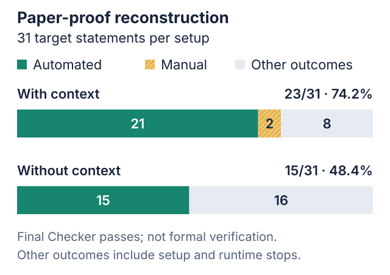
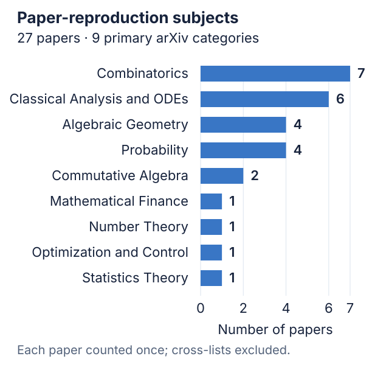

# Paper reproduction: with and without context

Does giving the solver context from a paper help it reconstruct a proof? We
tested two setups, each covering **31 target statements from 27 arXiv mathematics
papers**. In both, the solver was not given the target's proof.

## What does “context” mean?

- **With context:** the target, background from the paper, and supporting
  statements selected by the cleaner.
- **Without context:** the target and the definitions, notation, and assumptions
  needed to understand it, but no supplied supporting lemmas. The solver must
  establish any additional results it needs.

## Results

| Setup | Targets | Automated passes | Manual passes | Total pass rate |
|---|---:|---:|---:|---:|
| [With context](report.md) | 31 | 21 | 2 | 74.2% |
| [Without context](report_without_lemma.md) | 31 | 15 | 0 | 48.4% |

With context, **23/31** passed: 21 through the automated workflow and two through
manual Final Checker runs. The automated-only rate was **67.7% (21/31)**.
Without context, **15/31** passed, all automatically. We count each paper–target
pair once and keep setup failures in the totals.

A Final Checker pass is a model-based assessment, not formal verification.

Open either report to see the papers, target statements, and individual results.

## Which targets passed in each setup?

Across **28 matched target records**, the pass counts were **9 only with context**,
**2 only without context**, **12 in both**, and **5 in neither**.
See the [four-way breakdown by subject](paired_outcomes.md).

Both without-context-only passes came from one combinatorics paper. In the
with-context setup, the cleaner blocked those targets before solving began.
Three rows in each report have target labels we could not reliably match, so
they are left out of this comparison. The counts include the two manual passes;
“no pass” includes setup blocks and timeouts as well as rejected proofs.

<!-- BEGIN SUBJECT COVERAGE -->

## Subject coverage

The paper-reproduction collection covers **27 unique papers** across
**9 primary arXiv categories**. These counts describe the collection,
not subject-level accuracy.

Explore all 27 papers and their subjects

| Paper | Title | Primary subject |
|---|---|---|
| [2603.19491](https://arxiv.org/abs/2603.19491) | Families of Congruences for Partitions with $k$-colored odd parts | Number Theory (`math.NT`) |
| [2604.07183](https://arxiv.org/abs/2604.07183) | Stopping on the last success with unknown odds: asymptotic minimax optimality of the plug-in rule | Probability (`math.PR`) |
| [2604.25023](https://arxiv.org/abs/2604.25023) | The Mukai conjecture via Cox rings for special toric ambient embeddings | Algebraic Geometry (`math.AG`) |
| [2605.04912](https://arxiv.org/abs/2605.04912) | Can the $L^1$-$L^\infty$ duality be restored for non-dominated families of probability measures? | Probability (`math.PR`) |
| [2605.07617](https://arxiv.org/abs/2605.07617) | The Isomorphism Classes of the Surfaces $x_1^{a_1} + x_2^{a_2} + x_3^{a_3} + 1 = 0$ | Algebraic Geometry (`math.AG`) |
| [2605.19979](https://arxiv.org/abs/2605.19979) | Short Proofs in Algebraic and Enumerative Combinatorics | Combinatorics (`math.CO`) |
| [2605.31583](https://arxiv.org/abs/2605.31583) | Sharp minimax risks and phase transitions in sparse submatrix detection | Statistics Theory (`math.ST`) |
| [2606.02299](https://arxiv.org/abs/2606.02299) | Sharp sign uncertainty for trigonometric polynomials | Classical Analysis and ODEs (`math.CA`) |
| [2606.02847](https://arxiv.org/abs/2606.02847) | Sharp log-Sobolev inequalities and quartic stability on finite cyclic groups | Classical Analysis and ODEs (`math.CA`) |
| [2606.07143](https://arxiv.org/abs/2606.07143) | Fourier restriction estimates based on $L^q$-dimensions: beyond Stein--Tomas | Classical Analysis and ODEs (`math.CA`) |
| [2606.15249](https://arxiv.org/abs/2606.15249) | A universal support theorem for 1-Wasserstein optimal transport | Classical Analysis and ODEs (`math.CA`) |
| [2606.15297](https://arxiv.org/abs/2606.15297) | From Fractional to Set Tilings for Pairs of Lattices | Classical Analysis and ODEs (`math.CA`) |
| [2606.15432](https://arxiv.org/abs/2606.15432) | A Concavity Theorem for the Parisi PDE | Probability (`math.PR`) |
| [2606.15670](https://arxiv.org/abs/2606.15670) | A Note on an Approximate Fixed Point Theorem for $\operatorname{VMO}$ Maps | Classical Analysis and ODEs (`math.CA`) |
| [2607.03305](https://arxiv.org/abs/2607.03305) | Cash-invariant hull representation of divergence preferences | Mathematical Finance (`q-fin.MF`) |
| [2607.03856](https://arxiv.org/abs/2607.03856) | The exact generalized Turán number for $C_6$ in $C_8$-free graphs | Combinatorics (`math.CO`) |
| [2607.04347](https://arxiv.org/abs/2607.04347) | Strong Subgraph-Count Stability in $C_{2\ell+1}$-Free Graphs | Combinatorics (`math.CO`) |
| [2607.04798](https://arxiv.org/abs/2607.04798) | Revisiting $q$-Derangement Numbers via Decorated Permutations | Combinatorics (`math.CO`) |
| [2607.04831](https://arxiv.org/abs/2607.04831) | On two questions of Qi on saturated filtrations | Commutative Algebra (`math.AC`) |
| [2607.05330](https://arxiv.org/abs/2607.05330) | On balancing two-slice portions of cake | Combinatorics (`math.CO`) |
| [2607.05374](https://arxiv.org/abs/2607.05374) | The Minkowski grid has robustly many repeated distances | Combinatorics (`math.CO`) |
| [2607.06275](https://arxiv.org/abs/2607.06275) | Equality conditions for correlation inequalities | Combinatorics (`math.CO`) |
| [2607.06477](https://arxiv.org/abs/2607.06477) | A generalised cross-ratio and limits of local heights | Algebraic Geometry (`math.AG`) |
| [2607.07617](https://arxiv.org/abs/2607.07617) | Loop Equations Characterize Random Matrix Statistics | Probability (`math.PR`) |
| [2607.08871](https://arxiv.org/abs/2607.08871) | Derived Kunz and Radu--André Theorems | Commutative Algebra (`math.AC`) |
| [2607.09222](https://arxiv.org/abs/2607.09222) | Polyhedral extended formulations that approximate the Gomory closure for packing problems | Optimization and Control (`math.OC`) |
| [2607.09440](https://arxiv.org/abs/2607.09440) | Inaccessibility of the flat topology | Algebraic Geometry (`math.AG`) |

Primary categories and current titles were checked on **2026-09-07**
using [arXiv metadata](https://info.arxiv.org/help/api/user-manual.html).
Each paper is counted once, regardless of the number of tested targets or
cross-listings. The [metadata snapshot](subjects.json) records the retrieved
versions; these are not necessarily the versions used in the historical runs.

<!-- END SUBJECT COVERAGE -->

[All results](../README.md) · [Project README](../../README.md)
